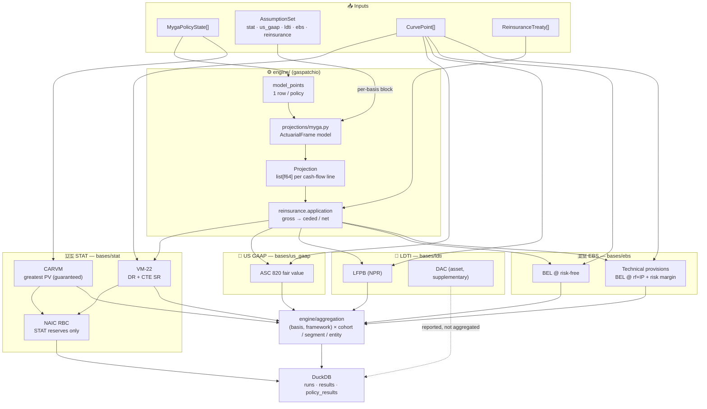
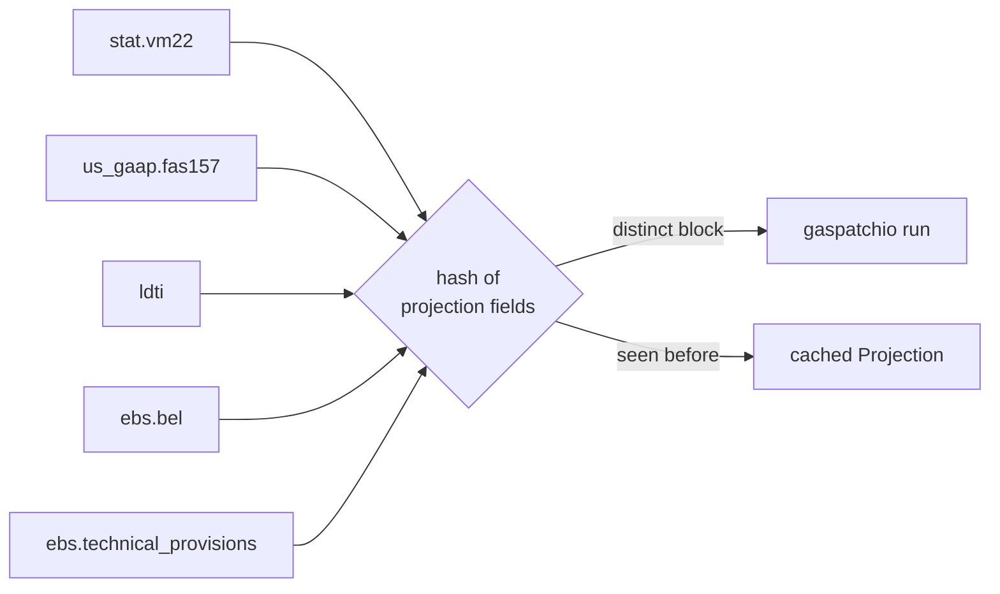
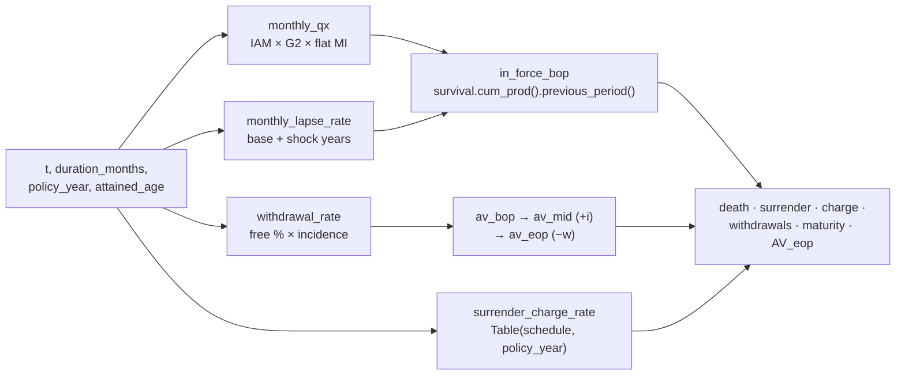
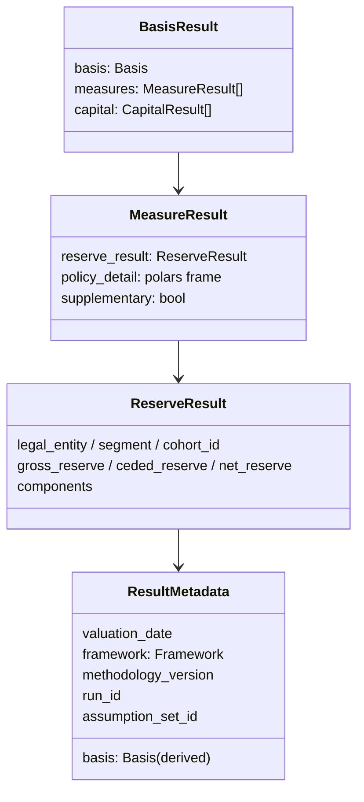

# AKIRA Architecture - Visual Diagrams

## Basis demarcation

## Projection per assumption block

Each framework config inherits `ProjectionBasisConfig`. The valuation context
hashes the projection fields (mortality, lapse, withdrawal, crediting) and runs
gaspatchio once per distinct block.

## MYGA gaspatchio model (per period t, all policies at once)

## Result record

