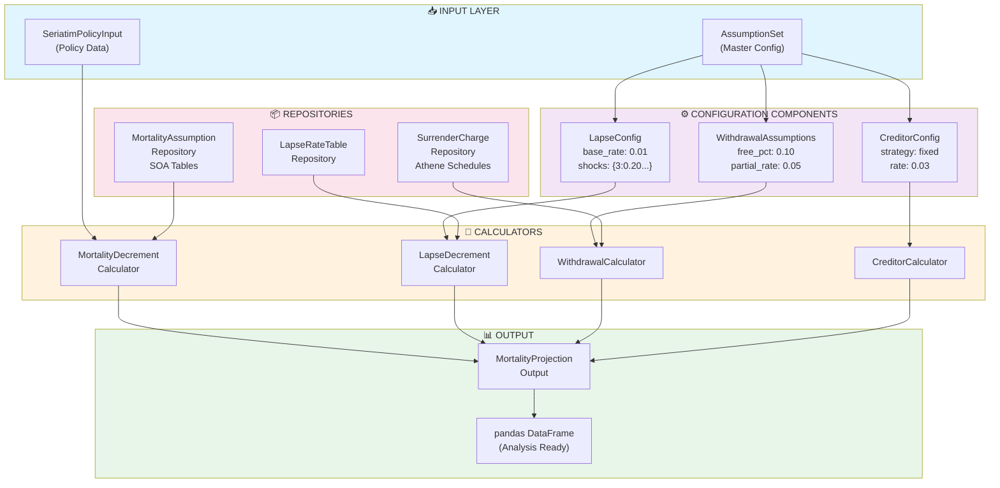
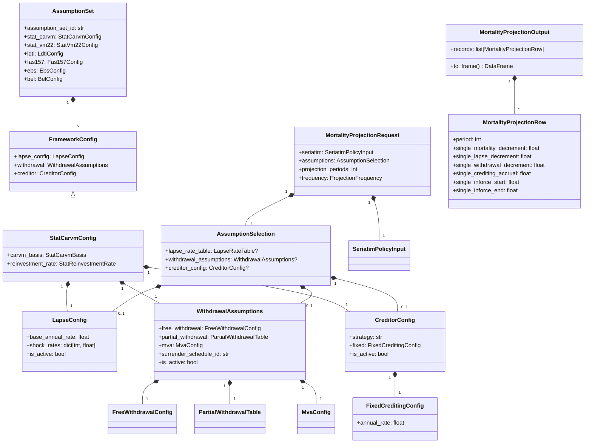
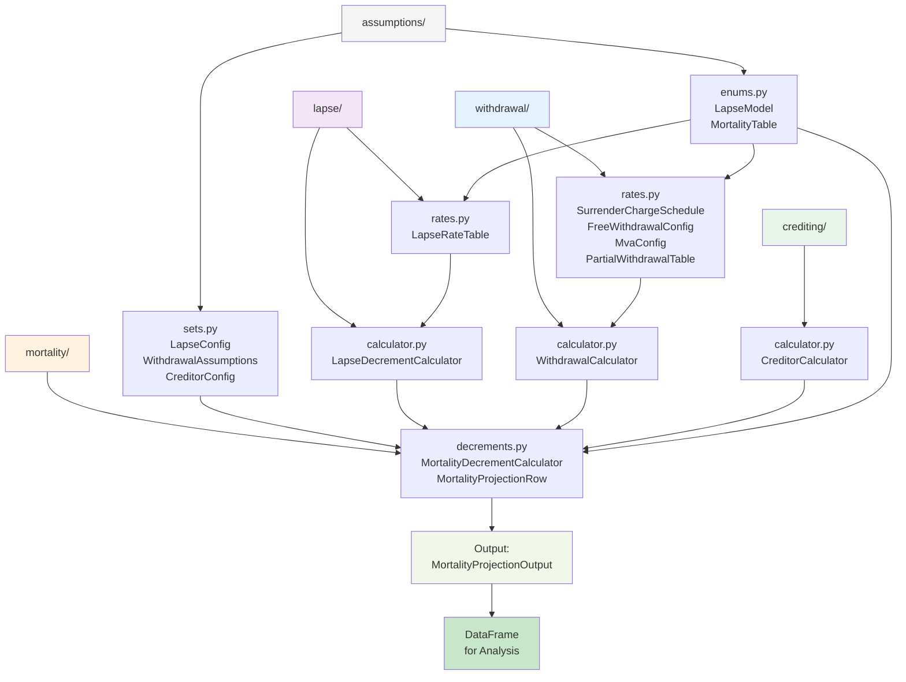
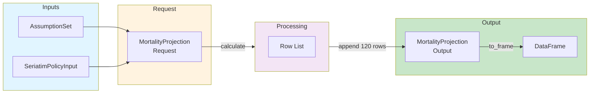
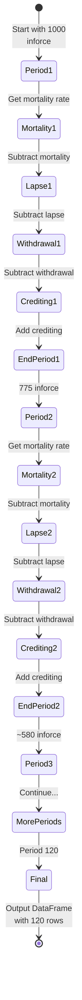
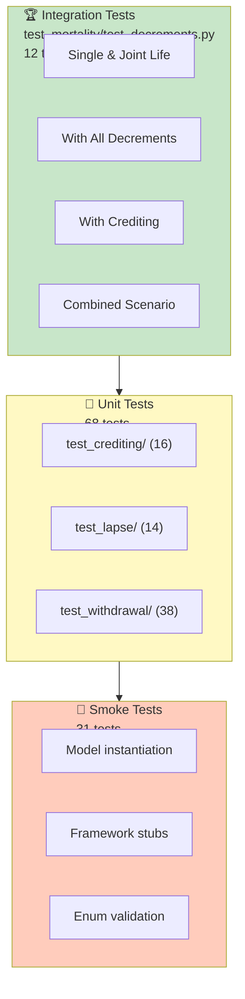

# AKIRA Architecture - Visual Diagrams

## System Architecture Overview

## Mortality Calculation Flow (Per Period)

```mermaid
graph LR
    subgraph Period["📍 Period N"]
        START["inforce_start<br/>= 1,000"]
    end
    
    subgraph Mort["💀 Mortality"]
        M["Get rates from<br/>MortalityRepository<br/>qx = 0.005"]
        M1["mortality_decrement<br/>= 1,000 × 0.005<br/>= 5"]
    end
    
    subgraph Lapse["📉 Lapse"]
        L["Get rate from<br/>LapseRateTable<br/>year 3 shock = 0.20"]
        L1["lapse_decrement<br/>= 1,000 × 0.20<br/>= 200"]
    end
    
    subgraph Withdraw["💳 Withdrawal"]
        W["Get rate from<br/>PartialWithdrawalTable<br/>base = 0.05"]
        W1["withdrawal_decrement<br/>= 1,000 × 0.05<br/>= 50"]
    end
    
    subgraph Credit["💰 Crediting"]
        C["Get rate from<br/>CreditorConfig<br/>fixed = 0.03"]
        C1["crediting_accrual<br/>= 1,000 × 0.03<br/>= +30"]
    end
    
    subgraph Calc["➗ Net Calculation"]
        E["inforce_end = max(<br/>1,000 - 5 - 200 - 50 + 30<br/>, 0)<br/>= 775"]
    end
    
    subgraph Output["📝 Row Output"]
        ROW["MortalityProjectionRow<br/>├─ mortality_decrement: 5<br/>├─ lapse_decrement: 200<br/>├─ withdrawal_decrement: 50<br/>├─ crediting_accrual: 30<br/>└─ inforce_end: 775"]
    end
    
    START --> M --> M1
    M1 --> L --> L1
    L1 --> W --> W1
    W1 --> C --> C1
    C1 --> E --> ROW
    
    style Period fill:#e3f2fd
    style Mort fill:#ffebee
    style Lapse fill:#fff3e0
    style Withdraw fill:#f3e5f5
    style Credit fill:#e8f5e9
    style Calc fill:#fce4ec
    style Output fill:#f1f8e9
```

## Class Relationships

## Module Dependencies

## Data Types Flow

## State Machine: Single Life Projection

## Test Coverage Pyramid

